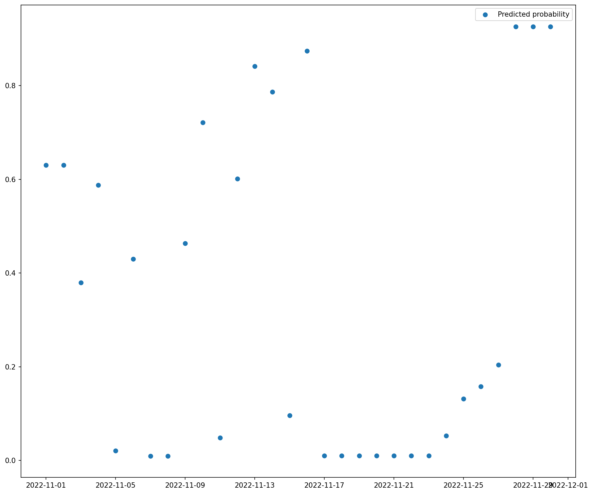

# LaundryAnalytics
## Current distribution

## How?
- Parsing my Gmail for email confirmations for laundry slots.
- Currently classifies a laundry-session as a binary event. Future work would be playing around with the length of the sessions. 

## TODO
- [ ] Skal man lave "windows" som man predicter på? Et vindue er en booking med dagene op til.
- [ ] Lav script til at sende alert når sands for at vaske er >0.8
- [ ] Få Github actions til at køre script hver dag
- [ ] Send email når relevant
